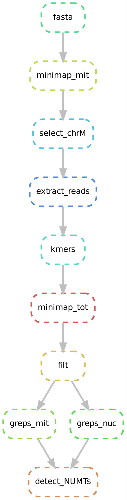

# NUMT-finder
Snakemake pipeline for detecting NUMTs from ONT reads

---
## Setup on the cluster: 
conda activate haplosplit

## How to use:
change the path to the fasta-fastq file inside the folder data/, then run:

```
snakemake --cores {number _of_cores} NUMTs.txt
```


